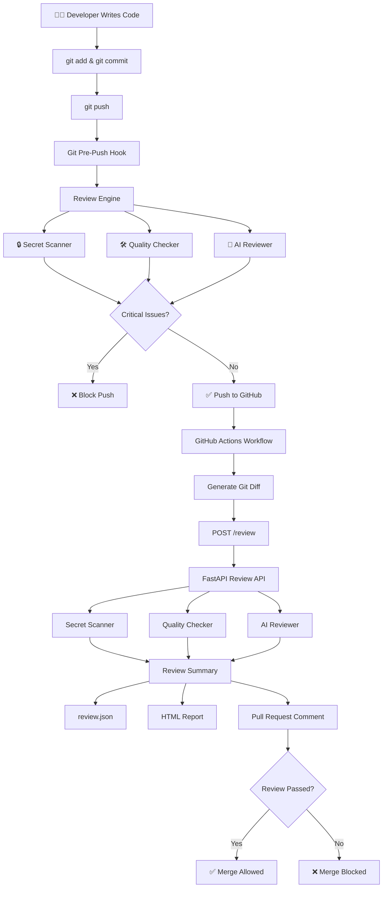

# 🤖 AI DevSecOps Code Review Pipeline

<p align="center">


</p>

An AI-powered DevSecOps code review pipeline that automatically scans code for **security vulnerabilities**, **code quality issues**, and **AI-generated recommendations** before code is merged into the main branch.

The project combines **Git Hooks**, **FastAPI**, **GitHub Actions**, **static code analysis**, and an **LLM (via OpenRouter)** to automate the code review process from a developer's local machine to GitHub Pull Requests.

---

# 📖 Overview

Code reviews are an essential part of software development, but manually reviewing every change can be time-consuming and inconsistent. Developers may accidentally commit hardcoded passwords, API keys, debug statements, or other issues that reduce code quality and introduce security risks.

This project automates the review process by analyzing only the code changes (Git Diff) instead of the entire repository. It performs security scanning, code quality analysis, and AI-powered code review before allowing code to be pushed or merged.

The review pipeline works in two stages:

| Stage | Description |
|--------|-------------|
| 💻 Local Review | Runs automatically before every `git push` using a Git pre-push hook. |
| ☁️ GitHub Review | Runs automatically through GitHub Actions whenever code is pushed or a Pull Request is created. |

This approach helps developers identify problems early, improve code quality, and reduce manual review effort.

---

# 🚀 Project Highlights

| Feature | Description |
|---------|-------------|
| 🤖 AI-Powered Review | Uses an LLM through OpenRouter to review code changes and provide recommendations. |
| 🔒 Security First | Detects hardcoded passwords, API keys, JWT tokens, and private keys before code reaches GitHub. |
| 🛠 Code Quality Analysis | Identifies debug statements, TODO comments, and common coding issues. |
| ⚡ Automated Workflow | Reviews code locally using Git Hooks and again on GitHub using GitHub Actions. |
| 🌐 FastAPI Backend | Exposes the review engine as a REST API that can be integrated with external systems. |
| 💬 Pull Request Reviews | Automatically posts AI-generated review summaries directly on GitHub Pull Requests. |
| 📄 HTML Reports | Generates a structured HTML report after every automated review. |
| 🚫 Merge Protection | Blocks pushes and GitHub workflows when critical issues are detected. |

---

# ✨ Features

## 🔒 Security Features

- Detects hardcoded passwords
- Detects API keys
- Detects private keys
- Detects JWT tokens
- Reviews only newly added or modified code using Git Diff

## 🛠 Code Quality Features

- Detects debug statements (`print()` and `console.log()`)
- Detects TODO comments
- Assigns severity levels to issues
- Calculates an overall security score

## 🤖 AI Features

- AI-powered code review using OpenRouter
- Reviews only changed code instead of the entire repository
- Provides developer-friendly recommendations
- Returns PASS or FAIL decisions with explanations

## ⚙️ Automation Features

- Automatic Git pre-push review
- GitHub Actions CI/CD integration
- Pull Request review comments
- HTML report generation
- JSON report generation
- Automatic workflow failure on critical findings

---

# 🔄 How It Works

The review process is fully automated from development to code review.

1. The developer writes or modifies code.
2. Before every `git push`, a Git pre-push hook automatically starts the local review.
3. The Review Engine extracts only the Git Diff (changed code).
4. The Secret Scanner searches for sensitive information such as passwords and API keys.
5. The Code Quality Checker looks for debug statements and common coding issues.
6. The AI Reviewer sends the Git Diff to an LLM through OpenRouter for intelligent code analysis.
7. If critical issues are found, the push is blocked immediately.
8. If the push succeeds, GitHub Actions automatically starts another review.
9. GitHub sends the Git Diff to the FastAPI Review API.
10. The API generates a review summary, HTML report, JSON report, and Pull Request comment.
11. If the review fails, the GitHub workflow also fails, preventing unsafe code from being merged.

---

# 🏗️ System Architecture

The following diagram illustrates the complete review pipeline from a developer's local machine to GitHub Pull Requests.



---

# 📂 Project Structure

```text
ai-code-review-demo/
│
├── app/
│   ├── main.py                    # FastAPI Review API
│   ├── models.py                  # API request/response models
│   └── __init__.py
│
├── scripts/
│   ├── ai_reviewer.py             # AI review using OpenRouter
│   ├── review_engine.py           # Main review pipeline
│   ├── secret_scanner.py          # Secret detection
│   ├── quality_checker.py         # Code quality analysis
│   └── post_review_comment.py     # Posts review to GitHub PR
│
├── hooks/
│   └── pre-push                   # Git pre-push hook
│
├── .github/
│   └── workflows/
│       └── ai-code-review.yml     # GitHub Actions workflow
│
├── run_review.py                  # Runs the local review engine
├── requirements.txt
├── Dockerfile
├── README.md
└── .env.example
```

---

# 🛠️ Technology Stack

| Category | Technology |
|-----------|------------|
| Programming Language | Python 3.12 |
| Backend Framework | FastAPI |
| AI Model | OpenRouter LLM |
| API Client | OpenAI Python SDK |
| Version Control | Git |
| Automation | Git Hooks |
| CI/CD | GitHub Actions |
| API Testing | Swagger UI |
| Reports | HTML & JSON |
| Deployment | Render |
| Containerization | Docker |

---

# ⚙️ Installation

## 1️⃣ Clone the Repository

```bash
git clone https://github.com/shreyaajha/ai-code-review-demo.git

cd ai-code-review-demo
```

---

## 2️⃣ Create a Virtual Environment

### Windows

```bash
python -m venv venv

venv\Scripts\activate
```

### Linux / macOS

```bash
python3 -m venv venv

source venv/bin/activate
```

---

## 3️⃣ Install Dependencies

```bash
pip install -r requirements.txt
```

---

## 4️⃣ Configure Environment Variables

Create a `.env` file in the project root.

Example:

```text
OPENROUTER_API_KEY=your_openrouter_api_key
```

The AI Reviewer uses this API key to communicate with the OpenRouter LLM.

---

## 5️⃣ Enable Git Hooks

Configure Git to use the project's custom hooks.

```bash
git config core.hooksPath hooks
```

You only need to run this command once after cloning the repository.

---

# 🚀 Project Setup

Once the installation is complete, the project is ready to use.

### Start the FastAPI Backend

```bash
uvicorn app.main:app --reload
```

The API will start locally at:

```text
http://127.0.0.1:8000
```

Interactive API documentation is available at:

```text
http://127.0.0.1:8000/docs
```

You can use the Swagger UI to test the `/review` endpoint without writing any client code.

Once the Git hook has been configured and the FastAPI service is running, every `git push` automatically triggers the local AI code review process.

---

# ▶️ Running the Project

After completing the installation and setup, you can use the project in two ways:

- **Locally** using the Git pre-push hook.
- **Automatically** through GitHub Actions.

---

# 🌐 Running the FastAPI Backend

The review engine is exposed as a REST API using **FastAPI**.

Start the server using:

```bash
uvicorn app.main:app --reload
```

The API will start at:

```text
http://127.0.0.1:8000
```

Interactive Swagger documentation:

```text
http://127.0.0.1:8000/docs
```

Using Swagger UI, you can test the `/review` endpoint by sending a Git Diff without writing any additional client code.

---

# 🔌 FastAPI Review API

## Endpoint

```http
POST /review
```

### Sample Request

```json
{
    "repository": "ai-code-review-demo",
    "branch": "feature/example",
    "diff": "git diff content..."
}
```

### Sample Response

```json
{
    "status": "PASS",
    "summary": {
        "security_score": 95,
        "risk": "LOW"
    },
    "recommendations": [],
    "ai_review": "PASS\nNo major issues found."
}
```

The API returns a structured response that can be consumed by GitHub Actions or any external application.

---

# 💻 Local AI Code Review

The project supports local code reviews before any code is pushed to GitHub.

Run the review manually:

```bash
python run_review.py
```

Or simply push your code:

```bash
git push
```

The configured Git pre-push hook automatically performs the following steps:

1. Extracts the Git Diff.
2. Runs the Secret Scanner.
3. Runs the Code Quality Checker.
4. Sends the diff to the AI Reviewer.
5. Calculates the security score.
6. Displays the review summary.
7. Blocks the push if critical issues are detected.

This helps developers fix problems before the code reaches the remote repository.

---

# 🧪 Negative Test Case

The following example contains intentionally insecure code.

```python
password = "admin123"

API_KEY = "abcdef123456"

print("Testing AI Code Reviewer")
```

Commit the changes:

```bash
git add .

git commit -m "Negative test"

git push
```

Expected Result:

```text
❌ Password detected

❌ API Key detected

⚠ Debug Statement detected

Final Verdict

❌ BLOCK PUSH
```

The push is rejected until the issues are resolved.

---

# ✅ Positive Test Case

Replace the insecure code with a safe implementation.

```python
def add_numbers(a, b):
    return a + b
```

Commit and push again.

```bash
git add .

git commit -m "Positive test"

git push
```

Expected Result:

```text
Risk Level      : LOW

Security Score  : 100/100

Final Verdict

✅ READY TO PUSH
```

The push is allowed because no critical issues are found.

---

# ☁️ GitHub Automated Review

Once the code is successfully pushed to GitHub, the review process continues automatically through GitHub Actions.

The workflow performs the following steps:

1. Checks out the repository.
2. Generates the Git Diff.
3. Sends the diff to the FastAPI Review API.
4. Performs security scanning.
5. Performs code quality analysis.
6. Generates an AI review.
7. Creates a `review.json` file.
8. Generates an HTML report.
9. Posts an AI review comment on the Pull Request.
10. Fails the workflow if the review status is **FAIL**.

No manual intervention is required after the push.

---

# 📄 Review Outputs

The project automatically generates the following outputs after each review.

| Output | Description |
|----------|-------------|
| `review.json` | Stores the structured review response returned by the API. |
| `report.html` | Human-readable HTML report summarizing the review. |
| Pull Request Comment | AI-generated review posted directly on the GitHub Pull Request. |
| GitHub Status Check | Indicates whether the review passed or failed. |

These reports help developers quickly understand issues and take corrective actions.

---
Project demo update.